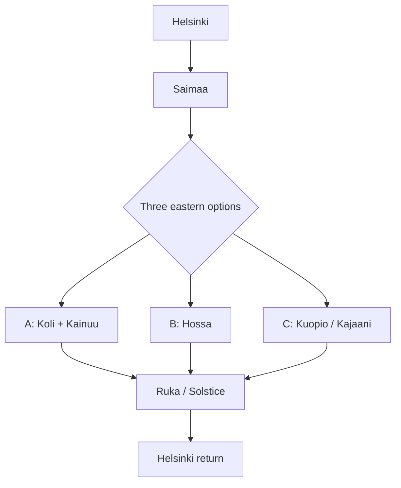
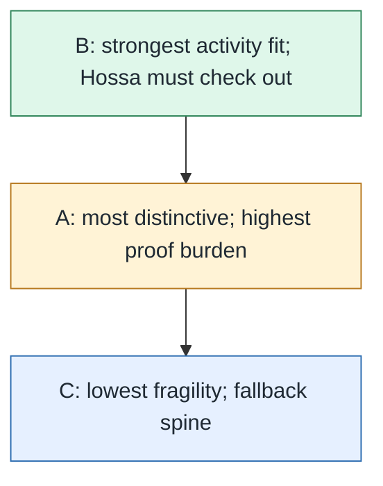

# Eastern Route Skeleton Visualization

## Question

How should the three eastern route skeletons be visualized before deciding which one to prune?

## Schematic Route View

This diagram is not geographic scale. It is intentionally compact for Obsidian's reading pane: shared Helsinki / Saimaa trunk, three route branches, fixed [[Entities/Ruka]] / [[Entities/Solstice Festival]] anchor, and simple return fallback.

## Geographic Sketch

This is a rough geographic sketch, not a road map. The place positions are approximate and the lines are planning corridors rather than navigable road routes.

## Option Logic

### Option A: Koli + Kainuu

- Shape: Helsinki -> [[Entities/Saimaa]] -> [[Entities/Koli National Park]] -> [[Entities/Kainuu]] / Kajaani -> [[Entities/Ruka]]
- Why keep it: potentially strongest scenic/cultural eastern bend. Lonely Planet adds [[Entities/Kuhmo]] wildlife/culture support after Koli, making it a real route identity rather than just a detour.
- Main test: does Koli add enough distinct value to justify the extra bend and staging risk before the Ruka deadline?

### Option B: Hossa

- Shape: Helsinki -> [[Entities/Saimaa]] -> [[Entities/Hossa National Park]] -> [[Entities/Ruka]]
- Why keep it: best match for water, cabins, huts, forest-lake activity, and the current [[Entities/Kainuu]] source-pack signal; Lonely Planet also supports Hossa as a less-visited lake/river/canoeing park near the Ruka/Oulanka zone.
- Main test: do Hossa rules, lodging, canoe/kayak services, and drive stages hold up under current-source checks?

### Option C: Kuopio / Kajaani

- Shape: Helsinki -> [[Entities/Saimaa]] -> [[Entities/Kuopio]] / Kajaani-style staging -> [[Entities/Ruka]]
- Why keep it: simplest operational spine. Useful if weather, fatigue, booking pressure, or checkout timing pushes against a more ambitious route.
- Main test: can it avoid becoming pure transit by adding enough good stops without losing its fallback value?

## Relative Planning Read

This is an interpretation, not a measured score. It captures the current planning read:

- Option A may be highly rewarding but has the highest proof burden.
- Option B is the strongest current activity fit if Hossa checks out.
- Option C is the practical fallback spine and should stay available even if it is less distinctive.

## What Would Prune A Skeleton

- Option A fails if Koli adds drive complexity without a distinct enough experience compared with Hossa or simpler staging.
- Option B fails if Hossa lodging, access rules, rental services, or drive timing are too brittle.
- Option C fails only as the primary plan if it feels too transit-heavy; it should still survive as fallback logic.

## Next Mapping Pass

For each skeleton, map:

- likely overnight clusters
- longest driving stage
- one or two activity anchors
- lodging flexibility
- rule/provider checks needed before booking
- whether it still works if house checkout is 2026-06-21 rather than 2026-06-22

## Sources

- [[Queries/Helsinki Ruka Route Comparison]]
- [[Sources/Eastern Saimaa Kainuu Ruka Source Pack]]
- [[Sources/Lonely Planet Finland 11th Edition]]
- [[Sources/Packrafting - Luontoon]]
- [[Sources/Solstice Festival Official Details]]
